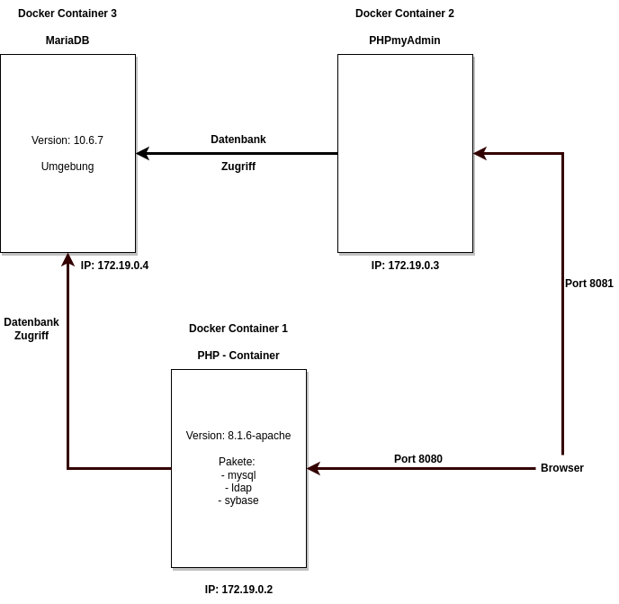

<!--Dokumentation-->
<!--Erstellt am 23.02.223-->
<!--Author: JR-->
<!-- Sprache dieses Dokument: HTML & Markdown-->

<!--Überschrift-->
<h1>Documentation - Webservices (Docker)</h1>

<!-- Inhaltsangabe-->
<h2>Table of contents</h2>
<ol>
  <li>Draft</li>
  <li>About this project</li>
  <li>Makefile</li>
</ol>

<!-- 1.Abschnitt-->
<h2>1. Draft</h2>

<br />
<br />

<!-- 2.Abschnitt-->
<h2>2. About this project</h2>
<h3>2.1 In this project, 3 Docker services are provided.</h3>

1. PHP Container (More details are explained in the point 2.2)
2. PHPmyAdmin Container -> [Link to Docker Hub -> PHPmyAdmin](https://hub.docker.com/_/phpmyadmin)
3. MariaDB Container -> [Link to Docker Hub -> MariaDB](https://hub.docker.com/_/mariadb)

<h3>2.2 How is the PHP image built in Dockerfile?</h3>

With the From command we use a base image to set up our own image later on
```
From php:8.0.18-apache
```

With the command WORKDIR it should go into the directory /var/www/html
```
WORKDIR /var/www/html
```

Now with the copy command it should copy over from the local src folder to the Docker host
```
COPY ./src/ /var/www/html
```
With the RUN command it should install updates and software.
```
RUN apt-get update && apt-get install -y\
  vim
  ...
  ..
  .
```

<!-- 3.Abschnitt-->
<h2>3. Makefile</h2>
<p>A Makefile is there to tell the make program what to do, for example to start or stop the Docker container.<br />
More details are given in the table.</p>

<p>Important!!! If necessary insert a sudo command before make</p>

<table>
  <tr>
    <th>Command</th>
    <th>background execution command</th>
    <th>Description</th>
  </tr>
    <!-- 1 -->
  <tr>
    <td>make default</td>
    <td>down up login</td>
    <td>Shortcut for make down up login</td>
  </tr>
    <!-- 2 -->
  <tr>
    <td>make build</td>
    <td>docker-compose build</td>
    <td>Build the image</td>
  </tr>
    <!-- 3 -->
  <tr>
    <td>make up</td>
    <td>docker-compose up -d</td>
    <td>Build and run the image</td>
  </tr>
    <!-- 4 -->
  <tr>
    <td>make up_attached</td>
    <td>docker-compose up</td>
    <td>Bild and run the container, but keep attached</td>
  </tr>
    <!-- 5 -->
  <tr>
    <td>make down</td>
    <td>docker-compose down</td>
    <td>Stop the container. Removes attached volumes</td>
  </tr>
    <!-- 6 -->
  <tr>
    <td>make login</td>
    <td>docker-compose exec app bash</td>
    <td>Log into container</td>
  </tr>
    <!-- 7 -->
  <tr>
    <td>make logs</td>
    <td>docker-compose logs -f</td>
    <td>Attach to container logs</td>
  </tr>
    <!-- 8 -->
  <tr>
    <td>make restart</td>
    <td>docker-compose restart</td>
    <td>Restart the container</td>
  </tr>
    <!-- 9 -->
  <tr>
    <td>make delete</td>
    <td>docker image prune -a && docker image ls</td>
    <td>All images will be deleted and after that all images should be listed</td>
  </tr>
    <!-- 10 -->
  <tr>
    <td>make test</td>
    <td>sh test.sh</td>
    <td>Test</td>
  </tr>
    <!-- 11 -->
  <tr>
    <td>make version</td>
    <td>docker-compose --version; docker --version</td>
    <td>Show version of Docker-compose and Docker</td>
  </tr>
</table>
